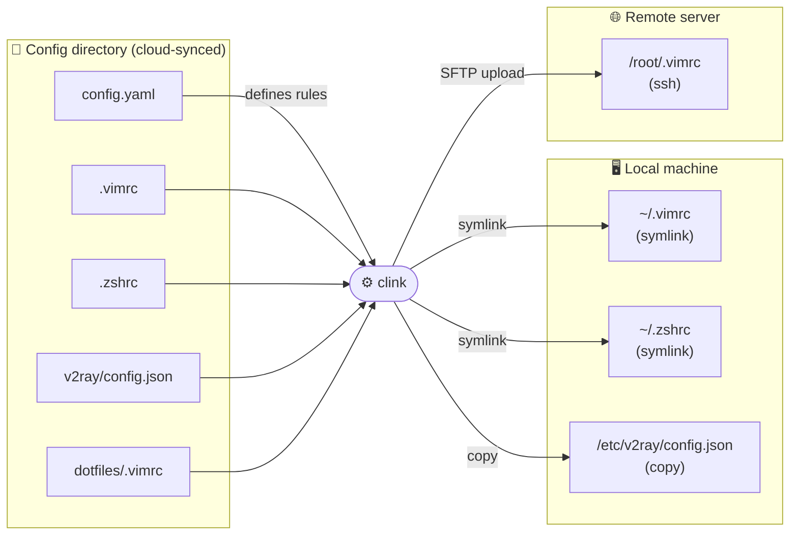
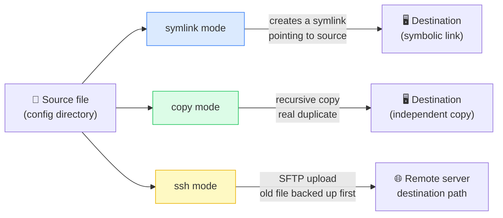
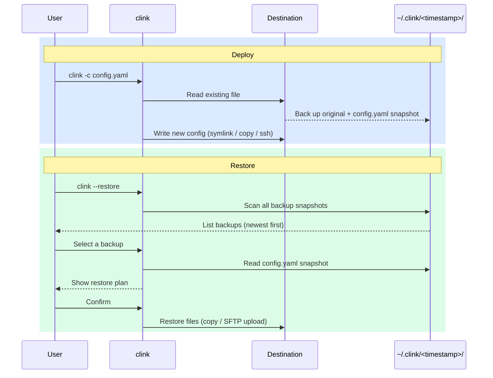

[中文](./README.zh.md)

# clink — Dotfile Manager

> Centralized dotfile manager — deploy configs via symlink, copy, or SSH.

[](https://github.com/alexmaze/clink/releases/latest)


`clink` lets you store all your config files in one place. Define deployment destinations in a `config.yaml` file and `clink` will deploy each file to the right location via symlink, copy, or SSH upload — while automatically backing up whatever was there before.

Centralizing your dotfiles makes saving and syncing them effortless. For example, you can sync your config directory across devices with Dropbox or any other sync tool. After a fresh OS install, just download your config directory and run `clink` to restore everything in one shot.



## Installation

### Option 1: go install (recommended — requires a local Go environment)

```sh
go install github.com/alexmaze/clink@latest
```

### Option 2: Download a pre-built binary

Go to the [Releases page](https://github.com/alexmaze/clink/releases/latest), download the binary for your platform, and place it somewhere on your `$PATH`.

```sh
# Example: macOS arm64
curl -L https://github.com/alexmaze/clink/releases/latest/download/clink-darwin-arm64.tar.gz | tar xz
sudo mv clink-darwin-arm64 /usr/local/bin/clink
```

## Quick Start

```sh
clink -c <config-dir>/config.yaml

# Run only specific rules (by index or name; repeatable)
clink -c <config-dir>/config.yaml -r 1
clink -c <config-dir>/config.yaml -r "vim config"
clink -c <config-dir>/config.yaml -r 1 -r "v2ray config"

# Restore from a previous backup
clink --restore

# Preview a restore without applying it
clink --restore -d

# Restore only a specific rule's files
clink --restore -r "vim config"

# Check whether all configured links are correctly established (read-only)
clink --check -c <config-dir>/config.yaml

# Check only specific rules
clink --check -c <config-dir>/config.yaml -r "vim config"
```

## Features

- [x] Specify config file locations via `config.yaml`
- [x] Automatic backup of existing files before deployment
- [x] Variable support — reference variables in rule path definitions
- [x] Pre/post script hooks per rule and globally (e.g. install software)
- [x] Multiple deployment modes: `symlink` / `copy` / `ssh` (remote SFTP upload)
- [x] Run only a subset of rules with the `-r` flag
- [x] Interactive restore from backup history (`--restore`)
- [x] Health-check to verify all configured links are correctly established (`--check`)

## CLI Flags

| Flag | Description |
|------|-------------|
| `-c, --config` | Path to `config.yaml` (default: `./config.yaml`) |
| `-d, --dry-run` | Preview changes without applying them |
| `-r, --rule` | Run only matching rules (1-based index or name, case-insensitive; repeatable) |
| `--restore` | Interactively restore from a previous backup (compatible with `-d` and `-r`) |
| `--check` | Check whether all configured links are correctly established (read-only, compatible with `-r`) |

## Configuration

### config.yaml example

```yaml
mode: symlink   # Global default mode (optional; default: symlink; values: symlink / copy / ssh)

hooks:           # Top-level hooks — run before/after all rules
  pre: echo 'start'
  post: echo 'all done'

ssh_servers:    # SSH server definitions (used by ssh mode)
  my-server:
    host: 192.168.1.1
    port: 22          # default: 22
    user: root
    key: ~/.ssh/id_rsa   # use either key or password; omit both to be prompted at runtime
    # password: secret

vars:
  V2RAY: /etc/v2ray

rules:
  - name: vim config
    # omitting mode inherits the global default (symlink here)
    hooks:       # Rule-level hooks — run before/after this rule
      pre: brew install vim
      post: echo 'vim ready'
    items:                      # List of files/directories to deploy
      - src: .src/.vimrc        # relative paths are resolved from the yaml file's directory
        dest: /root/.vimrc      # absolute paths are supported
      - src: ./.vim/autoload    # directories are supported; missing parent dirs are created
        dest: ~/.vim/autoload   # ~ expands to the current user's home directory

  - name: v2ray config (copy mode)
    mode: copy
    items:
      - src: ./v2ray/config.json
        dest: ${V2RAY}/config.json

  - name: remote server config (ssh mode)
    mode: ssh
    ssh: my-server          # references a key in ssh_servers
    items:
      - src: ./dotfiles/.vimrc
        dest: /root/.vimrc  # remote path — no local path processing applied
```

### Deployment Modes

| Mode | Description |
|------|-------------|
| `symlink` (default) | Creates a symlink at the destination pointing to the source file |
| `copy` | Recursively copies the source file/directory to the destination (a real copy) |
| `ssh` | Uploads the source file to a remote server via SFTP; the existing remote file is downloaded to the local backup directory first |

- `mode` can be set globally at the top level; individual rules can override it
- SSH authentication prefers a key file (`key`), then a password (`password`); if neither is set, you are prompted interactively at runtime



## Backup & Restore

### Backup

Each time you deploy, `clink` backs up the existing file at each destination to `~/.clink/<timestamp>/`. A snapshot of the `config.yaml` used for that run is also saved, so a restore can reconstruct the exact rules, modes, and SSH settings.

Example backup directory layout:

```
~/.clink/
  20260326_150405/
    config.yaml              ← config snapshot
    root/.vimrc              ← backed-up original (path mirrors the destination path)
    root/.vim/autoload/...
  20260325_100000/
    config.yaml
    ...
```

### Backup / Restore flow



### Restore

Run `clink --restore` to enter the interactive restore flow:

1. Scans all backups under `~/.clink/` and lists them in reverse-chronological order
2. You select a backup
3. `clink` parses the config snapshot to determine each file's restore mode (symlink/copy → local copy; ssh → re-upload)
4. The restore plan is displayed; execution proceeds after your confirmation

**Notes:**

- Restore always uses **copy mode** (no symlinks pointing into the backup directory)
- For older backups without a `config.yaml` snapshot, all files are restored locally via copy mode
- Files originally deployed via SSH are re-uploaded to the remote server via SFTP; passwords are prompted as needed
- Restore overwrites files at the destination without merging
- Use `-d` to preview the restore plan without applying it
- Use `-r` to restore only the files belonging to a specific rule

## Health Check

Run `clink --check -c <config-dir>/config.yaml` to verify that all configured items are correctly deployed — without making any changes to the filesystem.

For each item `--check` reports one of three statuses:

| Symbol | Status | Meaning |
|--------|--------|---------|
| ✔ | OK | Correctly established |
| ! | Wrong | Destination exists but is incorrect (e.g. symlink points to the wrong target, or the path is a regular file instead of a symlink) |
| ✘ | Missing | Destination does not exist |

Example output:

```
[1/2] vim config  [symlink]
  ✔  ~/.vimrc          →  /dotfiles/config/.vimrc
  ✘  ~/.vim            →  not found

[2/2] remote config  [ssh → root@192.168.1.1]
  SSH connected to root@192.168.1.1
  ✔  /root/.bashrc     →  exists on remote
  !  /root/.vimrc      →  exists but is not a symlink

Summary:  2 ✔ ok,  1 ! wrong,  1 ✘ missing,  0 errors.
```

`--check` exits with code **0** if everything is OK, or **1** if any item is wrong, missing, or errored — making it easy to use in scripts or CI.

## Hook Execution Order

```
pre hook (global)
  ↓
[rule 1] pre hook → backup + deploy items → post hook
[rule 2] pre hook → backup + deploy items → post hook
  ↓
post hook (global)
```

> Hook commands are executed via `sh -c`. A non-zero exit code **immediately aborts** the entire run.
