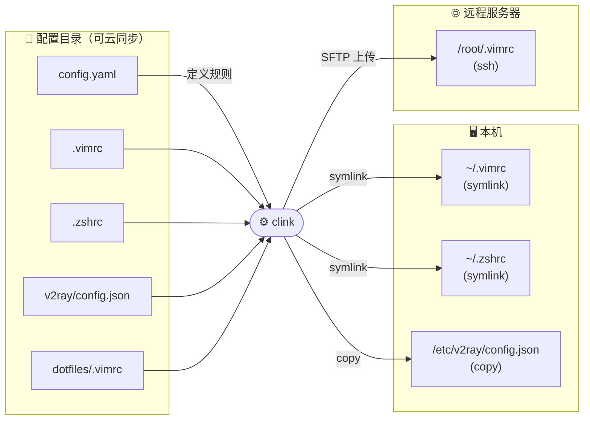
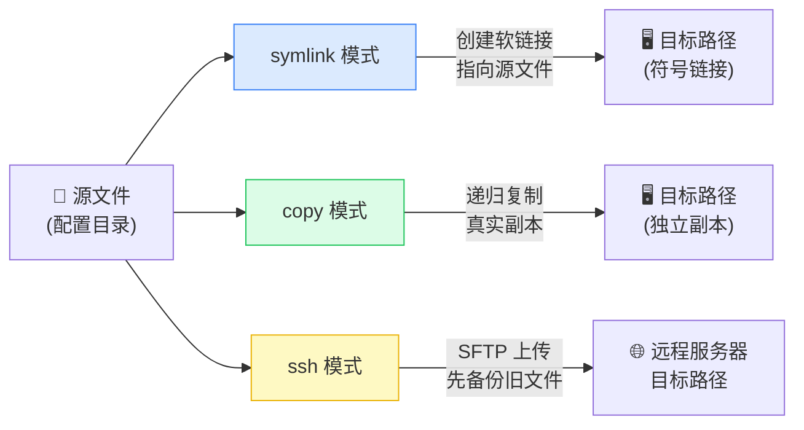
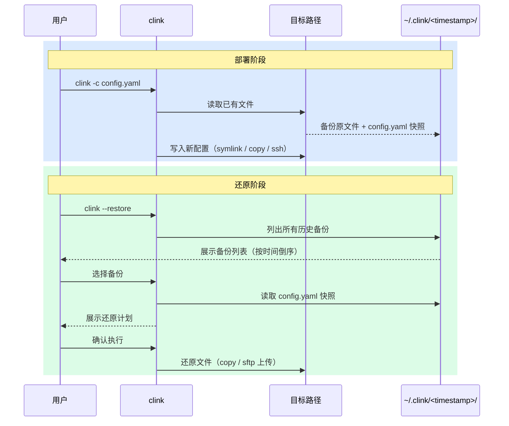

[English](./README.md)

# clink 配置管理器

> Centralized dotfile manager — deploy configs via symlink, copy, or SSH.

[](https://github.com/alexmaze/clink/releases/latest)


使用 `clink` 可以方便的把你的配置文件集中保存，只需要在 `config.yaml` 文件中定义文件需要分发的目的地，`clink` 就可以帮你将配置文件通过软链、复制或 SSH 上传等方式部署到指定位置，并将原文件备份起来。

集中存放配置文件可以让配置保存、同步更加方便，例如你可以将配置文件目录通过 `dropbox`、 `百度网盘` 等工具在多设备之间进行同步，重装电脑后也只需要下载配置文件目录后通过 `clink` 一键将配置文件应用到新的系统里。



## 安装

### 方式一：go install（推荐，需要本地 Go 环境）

```sh
go install github.com/alexmaze/clink@latest
```

### 方式二：下载预编译二进制

前往 [Releases 页面](https://github.com/alexmaze/clink/releases/latest) 下载对应平台的二进制文件，解压后放入 `$PATH` 即可。

```sh
# 以 macOS arm64 为例
curl -L https://github.com/alexmaze/clink/releases/latest/download/clink-darwin-arm64.tar.gz | tar xz
sudo mv clink-darwin-arm64 /usr/local/bin/clink
```

## 快速开始

```sh
clink -c <配置文件目录>/config.yaml

# 只运行指定 rule（按序号或名称，可多次传入）
clink -c <配置文件目录>/config.yaml -r 1
clink -c <配置文件目录>/config.yaml -r "vim 配置"
clink -c <配置文件目录>/config.yaml -r 1 -r "v2ray 配置"

# 从历史备份中还原
clink --restore

# 还原时只预览不执行
clink --restore -d

# 还原时只还原指定 rule 的文件
clink --restore -r "vim 配置"

# 检查所有配置的链接是否已正确建立（只读，不修改任何文件）
clink --check -c <配置文件目录>/config.yaml

# 只检查指定 rule
clink --check -c <配置文件目录>/config.yaml -r "vim 配置"
```

## 功能特性

- [x] 通过 `config.yaml` 配置文件指定配置文件位置
- [x] 自动备份原始文件
- [x] 支持变量，可在 rules 的路径定义中引用变量
- [x] 规则执行前后支持脚本 Hook（例如安装软件等）
- [x] 多种分发模式：`symlink`（软链接）/ `copy`（本地复制）/ `ssh`（远程 SFTP 上传）
- [x] 通过 `-r` 参数指定只运行部分 rules
- [x] 选择历史备份进行还原（`--restore`）
- [x] 检查所有配置的链接是否已正确建立（`--check`）

## 命令行参数

| 参数 | 说明 |
|------|------|
| `-c, --config` | 指定 config.yaml 路径（默认 `./config.yaml`）|
| `-d, --dry-run` | 只展示变更，不实际执行 |
| `-r, --rule` | 只运行匹配的 rule（按 1-based 序号或名称，大小写不敏感；可多次指定）|
| `--restore` | 交互式选择历史备份进行还原（可配合 `-d` 和 `-r` 使用）|
| `--check` | 检查所有配置的链接是否已正确建立（只读，可配合 `-r` 使用）|

## 配置文件说明

### config.yaml 示例

```yaml
mode: symlink   # 全局默认模式（可选，默认 symlink；可选值：symlink / copy / ssh）

hooks:           # 顶层 hook，在所有规则执行前/后运行
  pre: echo 'start'
  post: echo 'all done'

ssh_servers:    # SSH 服务器定义（ssh 模式使用）
  my-server:
    host: 192.168.1.1
    port: 22          # 默认 22
    user: root
    key: ~/.ssh/id_rsa   # key 与 password 二选一；都不填则运行时 prompt 输入密码
    # password: secret

vars:
  V2RAY: /etc/v2ray

rules:
  - name: vim 配置
    # mode 不写则继承全局（此处为 symlink）
    hooks:       # rule 级别 hook，在该规则执行前/后运行
      pre: brew install vim
      post: echo 'vim ready'
    items:                      # 配置文件（夹）列表
      - src: .src/.vimrc        # 可以使用相对路径，起始路径为 yaml 文件所在目录
        dest: /root/.vimrc      # 可以使用绝对路径
      - src: ./.vim/autoload    # 可以指定文件夹，不存在的文件夹会自动创建
        dest: ~/.vim/autoload   # 可以使用 ~ 代表当前用户的 home 目录

  - name: v2ray 配置 (copy 模式)
    mode: copy
    items:
      - src: ./v2ray/config.json
        dest: ${V2RAY}/config.json

  - name: 远程服务器配置 (ssh 模式)
    mode: ssh
    ssh: my-server          # 引用 ssh_servers 中的 key
    items:
      - src: ./dotfiles/.vimrc
        dest: /root/.vimrc  # 远程路径，不做本地路径处理
```

### 分发模式

| 模式 | 说明 |
|------|------|
| `symlink`（默认） | 在目标路径创建软链接，指向源文件 |
| `copy` | 将源文件/目录递归复制到目标路径（真实副本）|
| `ssh` | 通过 SFTP 将源文件上传到远程服务器；旧文件会先下载到本地备份目录 |

- `mode` 可在顶层设置全局默认值，rule 级别可单独覆盖
- SSH 鉴权优先使用密钥文件（`key`），其次密码（`password`），都不填则运行前交互式 prompt



## 备份与还原

### 备份

每次部署时，clink 会将目标位置的原有文件备份到 `~/.clink/<timestamp>/` 目录中。同时会保存一份当次使用的 `config.yaml` 快照，以便还原时能够还原完整的规则、模式和 SSH 信息。

备份目录结构示例：

```
~/.clink/
  20260326_150405/
    config.yaml              ← 配置快照
    root/.vimrc              ← 备份的原文件（路径结构与目标路径一致）
    root/.vim/autoload/...
  20260325_100000/
    config.yaml
    ...
```

### 备份 / 还原流程



### 还原

使用 `clink --restore` 进入交互式还原流程：

1. 扫描 `~/.clink/` 下的所有备份，按时间倒序列出
2. 用户选择一个备份
3. 解析配置快照，确定每个文件的还原模式（symlink/copy → 本地复制，ssh → 重新上传）
4. 展示还原计划，用户确认后执行

**注意事项：**

- 还原时统一使用 **copy 模式**（不创建 symlink 指向备份目录）
- 对于旧版本备份（无 config.yaml 快照），所有文件按 copy 模式还原到本地
- SSH 模式的文件会通过 SFTP 重新上传到远程服务器，密码按需交互输入
- 还原会直接覆盖目标位置的已有文件
- 使用 `-d` 可仅预览还原计划而不执行
- 使用 `-r` 可只还原指定规则的文件

## 健康检查

使用 `clink --check -c <配置文件目录>/config.yaml` 可以检查所有配置的文件是否已正确部署，**不会对文件系统做任何修改**。

每个 item 会报告以下三种状态之一：

| 符号 | 状态 | 含义 |
|------|------|------|
| ✔ | OK | 已正确建立 |
| ! | 异常 | 目标路径存在，但状态不对（如软链接指向错误的目标，或路径是普通文件而非软链接）|
| ✘ | 缺失 | 目标路径不存在 |

示例输出：

```
[1/2] vim 配置  [symlink]
  ✔  ~/.vimrc          →  /dotfiles/config/.vimrc
  ✘  ~/.vim            →  not found

[2/2] 远程服务器配置  [ssh → root@192.168.1.1]
  SSH connected to root@192.168.1.1
  ✔  /root/.bashrc     →  exists on remote
  !  /root/.vimrc      →  exists but is not a symlink

Summary:  2 ✔ ok,  1 ! wrong,  1 ✘ missing,  0 errors.
```

所有 item 均正常时退出码为 **0**，有任何异常/缺失/错误时退出码为 **1**，方便在脚本或 CI 中使用。

## Hook 执行流程

```
pre hook (全局)
  ↓
[rule 1] pre hook → backup + deploy items → post hook
[rule 2] pre hook → backup + deploy items → post hook
  ↓
post hook (全局)
```

> Hook 命令通过 `sh -c` 执行，若退出码非 0 则**立即中止**整个流程。
